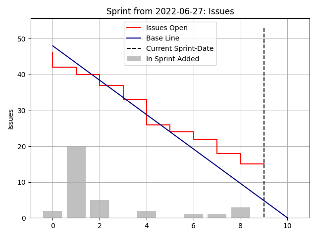

[](https://github.com/psf/black)
[](https://pycqa.github.io/isort/)

# Jira Sprint Velocity
- generate a Sprint Velocity Matplotlib Graph

## How To Use
```shell
$ jira_statistics --help

```

## Used Jira Filter
- to get all issues for generating the Velocity we're using following Statement
```shell
project = <project> and issuetype in subTaskIssueTypes() AND Sprint = <sprint_id> AND (resolution = unresolved or resolved >= <sprint_start_date>)
```

## Authentication
- the rest api from jira uses a Bearer Token, this Token can be created directly in Jira under Profile


## Example Result

